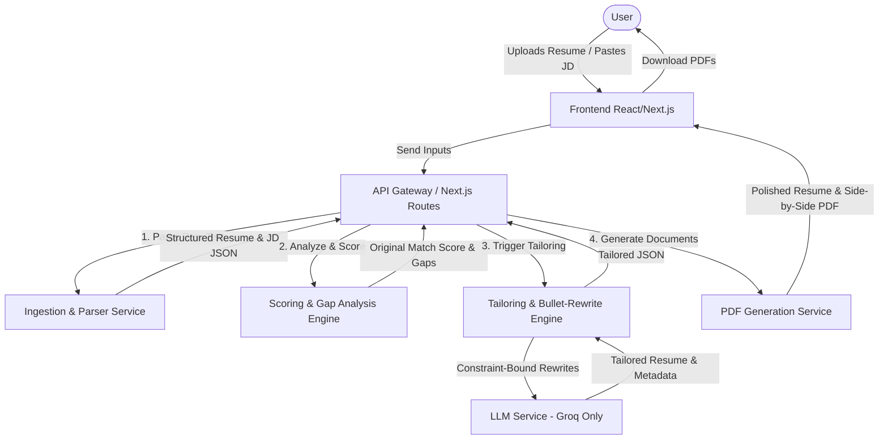
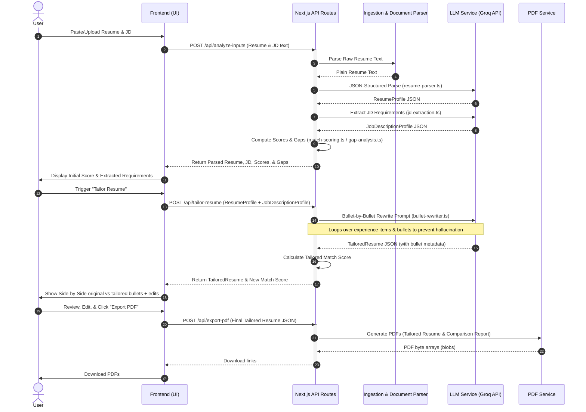

# Resume Shapeshifter — System Architecture Document

## 1. System Overview

**Resume Shapeshifter** is a Job Description (JD)-to-resume tailoring engine designed to help job seekers optimize their resumes for specific roles. Given a candidate's existing resume and a target job description, the system parses both, evaluates their alignment (scoring and gap analysis), truthfully rewrites resume bullets and summaries to better highlight relevant experience, and generates a side-by-side comparison report as well as a polished tailored resume PDF.

The primary design constraint is **truthfulness**: the engine must never fabricate roles, credentials, metrics, or technologies. Instead, it rephrases existing experiences to align with the jargon, responsibilities, and emphasis of the target job description.



---

## 2. Core Architectural Principles

To ensure system reliability, quality, and trust, the architecture is built on five core principles:

1. **Truthfulness Guardrails (Constraint-Bound Generation)**
   * Every LLM rewrite operation must be bounded by strict prompt instructions, verification checks, and post-processing filters to prevent the hallucination or fabrication of experience.
   * Unverifiable information is highlighted as a suggestion for user approval rather than inserted directly.
2. **Structured JSON Communication (Type-Safe Boundaries)**
   * Data exchanged between components (Frontend, Backend, LLM API) is strictly typed and validated using **Zod** schemas. 
   * The LLM must output structured JSON to ensure deterministic parsing and UI rendering.
3. **Pipeline-Based Orchestration (Modular Execution)**
   * Rather than using a single, large "all-in-one" LLM prompt, the tailoring pipeline is decomposed into separate micro-tasks (Parsing $\rightarrow$ JD Extraction $\rightarrow$ Scoring $\rightarrow$ Bullet-by-Bullet Rewrite $\rightarrow$ Gap Analysis $\rightarrow$ Assembly).
   * This reduces context window noise, improves accuracy, and makes testing and debugging prompts simple.
4. **Explainable AI Matching**
   * The scoring engine does not present a single arbitrary percentage. Instead, the final match score is composite, reflecting distinct categories (skills, seniority, keywords) and accompanied by textual evidence and recommendations.
5. **Decoupled Document Rendering**
   * Resume presentation is separated from parsing/rewriting. The application renders resumes using standard web markup in the editor and exports them using a headless rendering engine to guarantee high-fidelity PDF output.

---

## 3. System Components & Modular Decomposition

The application is structured as a unified Next.js application with React on the frontend and API routes on the backend. This enables a zero-infrastructure footprint suitable for local prototyping and simple deployment.

```
/RESUME-BUILDER-PROJECT
│
├── /docs                         # Documentation files
│   ├── problemStatement.md       # Product requirements & scope
│   ├── architecture.md           # [This File] Detailed architecture specifications
│   ├── Implementation-plan.md    # Actionable build phases
│   └── edge-case.md              # Boundary conditions & mitigations
│
├── /prompts                      # Isolated prompt files
│   ├── jd-extraction.ts          # Extracts job requirements
│   ├── resume-parser.ts          # Extracts resume details
│   ├── match-scoring.ts          # Scores resume against JD
│   ├── bullet-rewriter.ts        # Rewrites bullet points safely
│   └── gap-analysis.ts           # Compiles skills & experience gaps
│
├── /components                   # React UI components
│   ├── AppLayout.tsx             # Main dashboard shell
│   ├── ResumeInput.tsx           # Text/file upload interface
│   ├── JDInput.tsx               # Job description text/URL field
│   ├── ScoreCard.tsx             # Match score metrics & explanation
│   ├── GapAnalysisView.tsx       # Interactive gap recommendations
│   ├── SideBySideDiff.tsx        # Comparative editor layout
│   └── PDFExportButton.tsx       # PDF generation trigger
│
├── /lib                          # Core business logic & helpers
│   ├── schemas.ts                # Zod schemas & TypeScript types
│   ├── scoring.ts                # Score calculation algorithms
│   ├── pdf.ts                    # PDF generation orchestrator
│   └── llm.ts                    # LLM API configuration & client
│
└── /pages or /app                # Next.js page layouts & API routes
```

### 3.1. Frontend Tier (React & Tailwind CSS)
* **Design Language**: Rich, professional dashboard utilizing dark mode, clean typography (e.g., *Inter* or *Outfit*), subtle gradients, and card-based sections. Interactive elements feature micro-animations on hover and transition states.
* **State Management**: React State/Context handles application wizard flows (Step 1 to 6) and editor updates. No heavy state library is required; standard JSON representations are stored in browser session storage for caching.
* **Side-by-Side Editor**: Renders original and tailored text in parallel columns. Interactive controls let the user approve, reject, or edit individual bullet rewrites before final assembly.

### 3.2. API Tier (Next.js Serverless Routes)
* **`/api/parse-resume`**: Accepts raw text or uploaded documents, processes files, and passes structured text to the parser.
* **`/api/analyze-jd`**: Parses the target job description and extracts job properties.
* **`/api/score`**: Evaluates the match profile and returns the scoring breakdown.
* **`/api/tailor`**: Orchestrates the rewriting pipeline via structured LLM calls.
* **`/api/export-pdf`**: Server-side or client-side PDF renderer that converts HTML resume layouts into print-ready PDF files.

### 3.3. External Integration (LLM Provider)
* **Model**: Groq (`llama-3.3-70b-versatile` and `llama-3.1-8b-instant`) as the permanent primary engine. Structured JSON mode is enforced on all completions.
* **Validation Layer**: Built using Zod to parse and validate every LLM JSON output. If the output fails schema validation, the system triggers a self-correction retry loop.

---

## 4. Key Data Flow & Processing Pipeline

The following sequence diagram outlines the operational sequence of the system, starting from inputs to PDF generation.



---

## 5. Data Models & Zod Schemas

To ensure compliance across all system modules, we define strict TypeScript schemas using Zod.

```typescript
import { z } from 'zod';

// ==========================================
// 1. Resume Profile Schema
// ==========================================
export const WorkExperienceBulletSchema = z.object({
  text: z.string().describe("Raw bullet text describing actions, responsibilities, and metrics"),
});

export const WorkExperienceSchema = z.object({
  company: z.string().min(1),
  title: z.string().min(1),
  location: z.string().optional(),
  startDate: z.string(),
  endDate: z.string().describe("Date or 'Present'"),
  bullets: z.array(z.string()).describe("Chronological list of achievements and duties"),
});

export const ProjectSchema = z.object({
  name: z.string(),
  description: z.string(),
  bullets: z.array(z.string()),
  technologies: z.array(z.string()),
});

export const EducationSchema = z.object({
  institution: z.string(),
  degree: z.string(),
  major: z.string(),
  graduationDate: z.string(),
  gpa: z.string().optional(),
});

export const ResumeProfileSchema = z.object({
  contact: z.object({
    fullName: z.string(),
    email: z.string().email().optional().or(z.literal('')),
    phone: z.string().optional(),
    location: z.string().optional(),
    website: z.string().url().optional().or(z.literal('')),
  }),
  summary: z.string().optional().describe("Professional summary paragraph"),
  skills: z.array(z.string()).describe("List of technical tools, frameworks, and core skills"),
  experience: z.array(z.WorkExperienceSchema),
  projects: z.array(z.ProjectSchema).default([]),
  education: z.array(z.EducationSchema).default([]),
  certifications: z.array(z.string()).default([]),
});

export type ResumeProfile = z.infer<typeof ResumeProfileSchema>;

// ==========================================
// 2. Job Description (JD) Profile Schema
// ==========================================
export const JobDescriptionProfileSchema = z.object({
  jobTitle: z.string(),
  company: z.string().optional().describe("Name of hiring company if visible"),
  requiredSkills: z.array(z.string()).describe("Core non-negotiable hard skills"),
  preferredSkills: z.array(z.string()).describe("Bonus / nice-to-have skills"),
  responsibilities: z.array(z.string()).describe("Key duties described in JD"),
  qualifications: z.array(z.string()).describe("Education level or experience years requested"),
  tools: z.array(z.string()).describe("Specific software, libraries, and hardware platforms"),
  keywords: z.array(z.string()).describe("Domain-specific terminology found in the text"),
  seniorityLevel: z.enum(["Entry", "Mid", "Senior", "Lead", "Executive", "Unknown"]),
  domainSignals: z.array(z.string()).describe("Industry focus keywords (e.g. Fintech, Healthcare)"),
});

export type JobDescriptionProfile = z.infer<typeof JobDescriptionProfileSchema>;

// ==========================================
// 3. Match Score Schema
// ==========================================
export const MatchScoreSchema = z.object({
  overallScore: z.number().min(0).max(100),
  skillCoverageScore: z.number().min(0).max(100),
  responsibilityAlignmentScore: z.number().min(0).max(100),
  keywordScore: z.number().min(0).max(100),
  seniorityScore: z.number().min(0).max(100),
  criticalMissingRequirements: z.array(z.string()),
  explanation: z.string().describe("A markdown bullet list explaining details for each score category"),
});

export type MatchScore = z.infer<typeof MatchScoreSchema>;

// ==========================================
// 4. Tailored Resume & Rewrite Metadata Schema
// ==========================================
export const RewrittenBulletSchema = z.object({
  original: z.string(),
  tailored: z.string(),
  changeReason: z.string().describe("Explanation of why the bullet was rephrased and how it aligns with the JD"),
  keywordsAddressed: z.array(z.string()).describe("Specific JD keywords injected into the rephrase"),
  confidence: z.enum(["high", "medium", "low"]).describe("High if straightforward, Low if context was sparse"),
  riskFlag: z.string().optional().describe("Warning warning the user if the rephrase potentially stretches their experience"),
});

export const TailoredExperienceSchema = z.object({
  company: z.string(),
  title: z.string(),
  bullets: z.array(RewrittenBulletSchema),
});

export const TailoredResumeSchema = z.object({
  tailoredSummary: z.string(),
  tailoredSkills: z.array(z.string()).describe("Skills list, reordered or slightly rephrased based on JD"),
  tailoredExperience: z.array(TailoredExperienceSchema),
  tailoredProjects: z.array(z.object({
    name: z.string(),
    description: z.string(),
    bullets: z.array(RewrittenBulletSchema),
  })).default([]),
});

export type TailoredResume = z.infer<typeof TailoredResumeSchema>;

// ==========================================
// 5. Gap Analysis Schema
// ==========================================
export const ResumeGapSchema = z.object({
  name: z.string().describe("The missing skill or qualification (e.g. 'Kubernetes', '5+ Years in FinTech')"),
  importance: z.enum(["high", "medium", "low"]),
  jdEvidence: z.string().describe("Excerpt from the JD referencing this requirement"),
  resumeEvidence: z.string().describe("How the resume currently addresses this (or 'Not Mentioned')"),
  suggestedAction: z.string().describe("Actionable instructions for the candidate to address the gap"),
  canSafelyAdd: z.boolean().describe("True if it's a minor tooling item, False if it is a major credential gap"),
});

export const GapAnalysisSchema = z.object({
  gaps: z.array(ResumeGapSchema),
});

export type GapAnalysis = z.infer<typeof GapAnalysisSchema>;

// ==========================================
// 6. Complete Tailoring Run (Session Store)
// ==========================================
export const TailoringRunSchema = z.object({
  id: z.string().uuid(),
  timestamp: z.string(),
  originalResume: ResumeProfileSchema,
  jobDescription: JobDescriptionProfileSchema,
  originalScore: MatchScoreSchema,
  tailoredResume: TailoredResumeSchema.optional(),
  tailoredScore: MatchScoreSchema.optional(),
  gapAnalysis: GapAnalysisSchema,
});

export type TailoringRun = z.infer<typeof TailoringRunSchema>;
```

---

## 6. LLM Ingestion & Prompting Strategy

The system relies on isolated prompts to ensure focus, speed, and safety. Each prompt is encapsulated within a separate TypeScript file inside `/prompts/` and accepts inputs matching the Zod structures.

```
                  ┌──────────────────────┐
                  │ 1. Resume Ingestion  │
                  │   [resume-parser]    │
                  └──────────┬───────────┘
                             ▼
                  ┌──────────────────────┐
                  │  2. JD Extraction    │
                  │   [jd-extraction]    │
                  └──────────┬───────────┘
                             ▼
                  ┌──────────────────────┐
                  │ 3. Score & Gaps      │
                  │   [match-scoring]    │
                  │   [gap-analysis]     │
                  └──────────┬───────────┘
                             ▼
                  ┌──────────────────────┐
                  │ 4. Tailoring Engine  │
                  │  [bullet-rewriter]   │
                  └──────────────────────┘
```

### 6.1. Prompt Modules Details

#### 1. Resume Ingestion & Parsing (`/prompts/resume-parser.ts`)
* **Objective**: Transform unstructured text extracted from PDFs or pasted text boxes into the structured `ResumeProfile` JSON layout.
* **Instruction Strategy**: Instruct the LLM to identify logical sections (education, work history, projects). If headers are non-standard (e.g., "Where I've Been" instead of "Work Experience"), it must map them into standard sections. Bullet points must be kept intact. No rewrites allowed at this stage.

#### 2. JD Extraction (`/prompts/jd-extraction.ts`)
* **Objective**: Parse the target job description to extract the structured `JobDescriptionProfile`.
* **Instruction Strategy**: Instruct the LLM to isolate mandatory skills ("must-haves") from preferred skills ("nice-to-haves"), extract specific software or frameworks, and deduce the target seniority level based on titles, years of experience, and scope of responsibilities.

#### 3. Match Scoring (`/prompts/match-scoring.ts`)
* **Objective**: Compare the structured `ResumeProfile` against the `JobDescriptionProfile` and return a composite `MatchScore`.
* **Instruction Strategy**: Define concrete rules for scores:
  * **Skill Score**: $f(\text{Required Skills Coverage}, \text{Preferred Skills Coverage})$.
  * **Keyword Score**: Frequency of domain-specific keywords.
  * **Seniority Score**: Overlap between resume titles/roles and target seniority level.
  * The LLM must output an explanation string describing exact findings (e.g., "Deducted 15 points due to missing AWS experience, which is heavily featured in the JD").

#### 4. Gap Analysis (`/prompts/gap-analysis.ts`)
* **Objective**: Isolate requirements present in the JD but not found in the original resume.
* **Instruction Strategy**: Classify gaps by severity (e.g., missing a required degree is "High" severity; missing a secondary testing framework is "Low"). Generate practical, non-hallucinated actions (e.g., "If you have used Docker in any capacity, add it to your skills section; otherwise, prepare to discuss your readiness to learn this in an interview").

#### 5. Bullet-by-Bullet Rewriter (`/prompts/bullet-rewriter.ts`)
* **Objective**: Rewrite a set of resume bullets for a single experience block to optimize alignment with target JD keywords and responsibilities.
* **Input**: An array of original bullets + the target `JobDescriptionProfile`.
* **Instruction Strategy**:
  * **CRITICAL RULE**: Do not invent metrics (e.g., if a bullet says "improved page load speed", do not change it to "improved page load speed by 45%"). If the original has a metric, preserve it.
  * **CRITICAL RULE**: Do not claim experience in technologies not present in the original resume. Instead, frame the rephrase around shared conceptual skills (e.g., if JD requests "React" but the user has "Vue", the rewrite can emphasize "Single Page Application architecture and component lifecycle management").
  * **Reasoning Metadata**: The LLM must justify every single rewrite in `changeReason`.
  * **Confidence Scoring**: If context is too sparse to tailor a bullet safely, mark confidence as `low` and set `riskFlag` warning the user.

---

## 7. Truthfulness & Hallucination Guardrails

To prevent the generation of fake credentials or experience, the system implements a multi-layer guardrail design:

```
[Raw Inputs]
     │
     ▼
[LLM Prompt Constraints] ──► 1. "DO NOT invent metrics or technologies"
     │                       2. "Preserve original scope and seniority"
     ▼
[Structured Output JSON] ──► LLM outputs "confidence" & "riskFlag" per bullet
     │
     ▼
[Post-Processing Check]  ──► Backend compares parsed tags:
     │                       Are there new tech keywords not present in original resume?
     │                       If yes: Move to "Suggestions needing user verification"
     ▼
[User-in-the-Loop UI]   ──► Side-by-side highlighting with action buttons:
                             [Approve] [Edit] [Reject]
```

### 7.1. Verification Checks (Post-Processing)
* After the LLM outputs `TailoredResume`, the backend compares the `tailoredSkills` and rephrased bullets against the original `ResumeProfile`.
* If a new technical keyword (e.g., "Kubernetes") is added to the tailored resume but was completely absent in the original, the backend flags it in the UI with a warning icon: *"Warning: 'Kubernetes' was added to your skills to match the JD. Please confirm you have this experience before exporting."*

### 7.2. User-in-the-Loop Framework
* The system never publishes or exports the tailored resume automatically.
* The side-by-side comparative editor treats all rewritten bullets as drafts. The user must manually review and select **Approve**, **Edit** (which opens a text area), or **Reject** (which reverts to the original bullet) on each item.

---

## 8. PDF Generation & Side-by-Side Proof Document

The PDF generation module (`/lib/pdf.ts`) is a crucial output engine, yielding two distinct artifacts: the optimized standalone resume and the comparison proof.

| PDF Target | Layout Design | Purpose | Key Content |
|---|---|---|---|
| **Tailored Resume PDF** | Single-column, clean, print-friendly, black & white layout. | Submitted directly to job applications. | Tailored professional summary, optimized skills layout, approved tailored experience blocks, projects, and education. |
| **Side-by-Side Proof PDF** | Two-column landscape layout. Left: Original, Right: Tailored. | Personal portfolio review and verification artifact. | Job details header, original/tailored match scores, color-coded differences (green highlight for additions, red-strike for deleted parts), gap analysis summary, and truthfulness disclaimer. |

### 8.1. Headless Print Architecture
To achieve high-quality rendering without layout distortion:
1. **HTML-to-Print Compilation**: The backend serves dedicated print layouts on specific routes (e.g. `/print/tailored` and `/print/comparison`). These routes render clean, semantic HTML styled with Tailwind CSS print utility classes (e.g. `print:text-black`, `break-inside-avoid`).
2. **Headless Generation**: The PDF generator utilizes a server-side browser service (such as **Puppeteer** or **Playwright**) to open the print route locally, apply custom print styles (e.g., A4 page format, 0.5-inch margins), and print to standard PDF.
3. **Client-side Fallback**: If server-side headless browsers are unavailable in the hosting environment, the system utilizes the browser's native `window.print()` layout combined with CSS page configurations (`@page`) to trigger a clean PDF download dialog.

---

## 9. Security, Privacy, and Performance Edge Cases

### 9.1. Security and PII Management
* **Data Privacy**: Resume details (emails, phone numbers, addresses) represent Personally Identifiable Information (PII). For public API services, the system should allow an optional "Anonymize Resume" mode on the frontend that strips emails, phone numbers, and company names before sending payloads to LLM endpoints, restoring them locally before final PDF compilation.
* **Secure API Configuration**: LLM API keys must be kept strictly on the server-side via environment variables (`GROQ_API_KEY`) and never exposed to the client.

### 9.2. Edge Cases and Mitigations

| Edge Case | Risk | Architecture Mitigation |
|---|---|---|
| **Multi-column Resume Ingestion** | Text extracted by simple PDF parsers can mix columns chronologically, creating incoherent text chunks. | The resume parsing prompt instructs the LLM to perform logical document reconstruction, grouping content by context and section headings rather than raw spatial line order. |
| **Inconsistent LLM JSON Format** | The LLM may omit fields, return trailing commas, or markdown fences, causing JSON parsing failures. | Enforce JSON output modes. Use Zod parsing in a try-catch block. On parsing failure, run a fallback repair regex or a rapid retry call with a simplified prompt asking to fix the malformed string. |
| **Excessive Keyword Stuffing** | The LLM might insert too many keywords from the JD, making the resume look synthetic or raising high-risk flags. | The bullet-rewriter prompt limits changes to a maximum of 2 injected keywords per bullet, requiring that the wording remains natural and professional. |
| **Vague or Very Short JDs** | If the JD is only one line (e.g., "Need senior react dev"), scoring and extraction can yield empty metrics. | The JD parser identifies low-quality inputs and triggers a warning to the user on the frontend suggesting they provide more details, while falling back to a generic framework template. |

---

## 10. Initial Implementation Plan (Phased Execution)

The project will be built in five sequential phases, as defined in `docs/Implementation-plan.md`:

```
┌──────────────────────────┐
│ Phase 1: Static UI       │ ◄── Mock data, page layouts, input panels
└────────────┬─────────────┘
             ▼
┌──────────────────────────┐
│ Phase 2: Ingestion & LLM │ ◄── Parsing, JD extraction, JSON schema checks
└────────────┬─────────────┘
             ▼
┌──────────────────────────┐
│ Phase 3: Rewrite Pipeline│ ◄── Bullet rewriter prompt, guardrail validations
└────────────┬─────────────┘
             ▼
┌──────────────────────────┐
│ Phase 4: PDF Generator   │ ◄── HTML print layouts, side-by-side rendering
└────────────┬─────────────┘
             ▼
┌──────────────────────────┐
│ Phase 5: Verification    │ ◄── End-to-end tests, edge case resolution
└──────────────────────────┘
```

See the [Implementation Plan](file:///Users/ansar/Documents/Certification%20in%20Data%20Science%20and%20Artificial%20Intelligence%20Program%20by%20E&ICT%20Academy,%20IIT%20Roorkee%21/Week%202%20Resume%20Shapeshifter%20%E2%80%94%20JD-to-Resume%20Tailoring%20Engine/RESUME-BUILDER-PROJECT/docs/Implementation-plan.md) for detailed task items and timeline.
